# 오픈마켓 서비스

## 1. 목표와 기능

### 1.1 목표
- 구매자와 판매자가 상품을 사고팔 수 있는 웹 기반 오픈마켓 플랫폼 구축
- 바닐라 JavaScript 기반의 SPA가 아닌 MPA 형태의 전통적인 웹 구조 구현
- 직접 UI/UX를 설계하고, 제공된 백엔드 API를 통해 상품 데이터 CRUD 구현
- 로그인/회원가입, 상품 목록, 상세, 장바구니 등 전자상거래의 핵심 플로우 체험
- DOM 조작 및 이벤트 핸들링 등 자바스크립트의 핵심 역량 강화

### 1.2 기능
- **회원가입 및 로그인**
  - 구매자 전용 탭으로 회원가입 및 로그인 기능 구현
  - 입력 유효성 검사 및 중복 확인 기능 포함
- **상품 목록 페이지**
  - 상품의 이미지, 이름, 가격 등을 리스트 형태로 출력
  - 클릭 시 상품 상세 페이지로 이동
- **상품 상세 페이지**
  - 상품 정보를 상세히 보여주며 수량 선택 및 총 가격 자동 계산
  - 재고 수량에 따라 `+` 버튼 비활성화 처리
- **글로벌 네비게이션 바 (GNB)**
  - 로그인 상태에 따라 GNB 구성 요소 동적으로 변경
  - 비로그인 상태에서 장바구니 클릭 시 로그인 모달 표시
- **마이페이지 드롭다운 UI**
  - 마이페이지 버튼 클릭 시 드롭다운 메뉴 출력
  - 외부 클릭 시 드롭다운 자동 닫힘 처리
  - 로그아웃 기능 포함
- **기타**
  - 각 기능은 MPA 구조로 각각의 `.html` 파일에 구현
  - CSS는 Figma 디자인을 기준으로 반응형 일부 적용

## 2. 개발 환경 및 배포 URL

### 2.1 개발 환경
- **Frontend**
  - HTML5 / CSS3 / JavaScript (ES6+)
  - 바닐라 JS 기반 DOM 조작 및 이벤트 처리
  - Fetch API를 활용한 비동기 통신
- **기술 스택**
  - 멀티 페이지 어플리케이션(MPA) 구조
  - Git, GitHub를 활용한 형상 관리
  - Figma 기반 UI 구현
- **백엔드**
  - 제공된 오픈마켓 API 서버와 연동 (별도 서버 구현 없음)

### 2.2 배포 URL
- 🔗 https://seonghyeon1022.github.io/open_market/  

- 🧪 테스트용 계정
  ```
  id : buyer1
  pw : weniv1234
  ```

### 2.3 URL 구조
- open_market

| App         | URL Path               | HTML File Name       | Note                           |
|-------------|------------------------|-----------------------|--------------------------------|
| open_market | `/index.html`          | `index.html`          | 홈 페이지 (상품 목록 포함)      |
| open_market | `/login.html`          | `login.html`          | 구매자/판매자 로그인 페이지     |
| open_market | `/signup.html`         | `signup.html`         | 구매자/판매자 회원가입 페이지   |
| open_market | `/product.html?id=123`  | `detail.html`         | 상품 상세 페이지 (product_id 기반) |
| open_market | `/error.html`           | `error.html`           | 404 에러 페이지   |
| open_market | (공통 UI)              | 없음                  | GNB 내 마이페이지 드롭다운, 모달 UI, 푸터 등 |

## 3. 요구사항 명세와 기능 명세

### 전체 페이지 흐름도

```mermaid
flowchart TD
    Start["홈 / 상품 목록 페이지\nindex.html"] --> Login["로그인 페이지\nlogin.html"]
    Start --> Signup["회원가입 페이지\nsignup.html"]

    Login -->|로그인 성공| Start
    Signup -->|회원가입 완료| Login

    Start --> Detail["상품 상세 페이지\ndetail.html?id=1"]
    Detail -->|비로그인 상태에서 구매 버튼 클릭| LoginModal["로그인 요청 모달"]

    Start --> HeaderGNB["상단 GNB 영역"]
    HeaderGNB --> Dropdown["마이페이지 드롭다운 UI"]
    Dropdown --> Logout["로그아웃 클릭 시 로그인 페이지 이동"]
```



## 4. 프로젝트 구조

📦  
 ├─ README.md  
 ├─ css  
 │ ├─ common.css  
 │ ├─ error.css  
 │ ├─ login.css  
 │ ├─ product.css  
 │ ├─ reset.css  
 │ ├─ signup.css  
 │ └─ style.css  
 ├─ error.html  
 ├─ images  
 ├─ index.html  
 ├─ js  
 │ ├─ api  
 │ │ ├─ apiClient.js  
 │ │ └─ config.js  
 │ ├─ components  
 │ │ ├─ createSignupForm.js  
 │ │ ├─ footer.js  
 │ │ ├─ header.js  
 │ │ ├─ loginModal.js  
 │ │ ├─ mypageDropdown.js.js  
 │ │ ├─ productCard.js  
 │ │ ├─ productDetailView.js  
 │ │ ├─ quantitySelector.js  
 │ │ ├─ quantitySelectorHandler.js  
 │ │ └─ renderGnb.js  
 │ ├─ core  
 │ │ ├─ auth.js  
 │ │ └─ storage.js  
 │ ├─ handlers  
 │ │ └─ loginModalHandler.js  
 │ ├─ login.js  
 │ ├─ main.js  
 │ ├─ productDetail.js  
 │ ├─ products.js  
 │ └─ signup.js  
 ├─ login.html  
 ├─ product.html  
 └─ signup.html  

## 6. 와이어프레임


## 7. 개발하며 느낀점

프로젝트를 진행하면서 여러 도전 과제를 마주했지만, 그 과정에서 성장하는 기쁨을 느꼈습니다. 복잡한 기능들을 하나씩 구현하며 웹 개발의 흐름과 원리를 더 깊이 이해할 수 있었고, 특히 사용자 경험을 고려한 UI와 유효성 검사, 그리고 비동기 통신 처리 부분에서 많은 배움을 얻었습니다. 부족한 부분도 있었지만, 그 또한 앞으로 개선해 나가야 할 중요한 자산이라 생각하며, 이번 프로젝트를 통해 실무 감각을 키우고 앞으로 더 나은 개발자로 성장할 수 있는 밑거름이 되었습니다. 앞으로도 꾸준히 학습하며 더 탄탄한 웹 서비스를 만들어 나가고 싶습니다.
